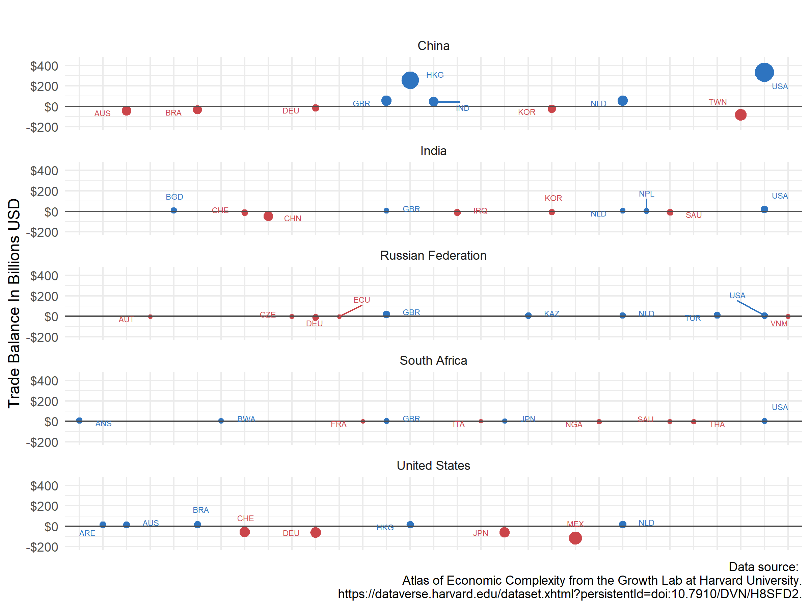

# international-trade-ilustrated
#### Summarize Eonomic Strength measured in terms of Deficits and Currencies

**Data Source**
---------------
As in my [other work](https://github.com/LNshuti/LNSHUTI.github.io), I use the Atlas of Economic Complexity from the Growth Lab at Harvard University because this data source is: 1) Detailed down to the product level that each country in the World trades from 1962 to 2019. 2) Standardized to simplify the process of building time series to track changes over time. 3) Regularly used and highly cited source with over *eighty thousand downloads*. It is also publicly available and can be downloaded [**here.**](https://dataverse.harvard.edu/dataset.xhtml?persistentId=doi:10.7910/DVN/H8SFD2)

**EDA: Exploratory Data Analysis**
--------------------------------

Below we plot trade relationships between a select group of African countries. For this plot, we sum data from 2015 to 2019. Note that the width of the edge represents the **trade balance** in US dollars between country x and country y for the given time period.

