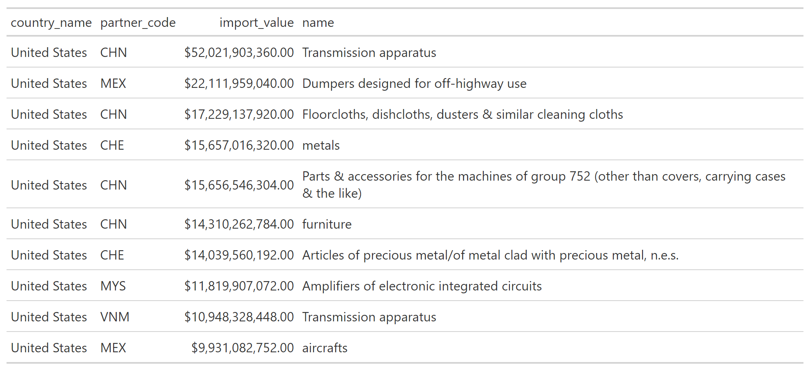

# Summarize Eonomic Strength measured in terms of Deficits and Currencies

**Introduction**
---------------
The purpose of this repository is to use available data to analyze the relative strength of countries. With the increasing geopolitical uncertaincy notably the war in Ukraine and associated chatter about WW3, competition between powerful countries is heating up. According to Ray Dalio's book [The Changing World Order](https://www.youtube.com/watch?v=xguam0TKMw8), the five most important measures that determine a Nation's present and future changes in wealth and income are the following: 

* Innovation 
* The capital market cycle 
* Internal order/disorder cycle
* External order disorder cycle 
* Acts of Nature 

Attempting to measure innovation by country is too difficult a task to approach in this exercise. One interesting study on innovation which focuses mostly on US corporations is Kai Wu's paper on [Investing in Innovation](https://sparklinecapital.files.wordpress.com/2022/04/sparkline-innovation.pdf). Similarly, we won't attempt to explain the relative order/disorder between countries nor do we have the capability to predict Acts of Nature. Using macroeconomic literature and open source data, this repo attempts to rank countries by 1) the value of exported goods and services, 2) debts levels(both public and private), and 3) the strength of each country's currency.  

**Data Source**
---------------
As in my [other work](https://github.com/LNshuti/LNSHUTI.github.io), I use the Atlas of Economic Complexity from the Growth Lab at Harvard University because this data source is: 1) Detailed down to the product level that each country in the World trades from 1962 to 2020. 2) Standardized to simplify the process of building time series to track changes over time. 3) Regularly used and highly cited source with over *eighty thousand downloads*. It is also publicly available and can be downloaded [**here.**](https://dataverse.harvard.edu/dataset.xhtml?persistentId=doi:10.7910/DVN/H8SFD2)

**Exploratory Data Analysis**
--------------------------------

Below we plot trade relationships between the United States, China,and Russia. For this plot, we sum data for the latest available year, 2020.  **Trade balance** is measured in **Billions US dollars**.

In 2020, China had a surplus relative to the United States, Hong Kong, Great Britain, India and the Netherlands. With the United States, China exported $200+ Billion dollars' worth of products and services **in excess** to the value of products/services China imported from the United States. Interestingly, Russia and the US had negligible differences in terms of the monetary value of their bilateral imports/exports. 

**Figure 1: 2020 Trade Balance**

Not all products are created equal. The plot above shows aggregated measures of exports but does not include details on what these traded products are. In the table below, we show the top exports for each of the countries from figure 1 classified by Maslow's hierarchy of needs. 

**Figure 2: Top 10 Product Imports**

**USA**

### References 
1. The Growth Lab at Harvard University. International Trade Data (SITC, Rev. 2). 2019-05-31. 2019. V5. Harvard Dataverse. URL. https://doi.org/10.7910/DVN/H8SFD2. doi/10.7910/DVN/H8SFD2

2. Wu, Kai. September 2022. Liquid Venture Capital. Sparkline Capital. https://www.sparklinecapital.com/post/liquid-venture-capital
