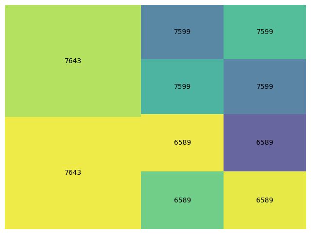

# Summarize Eonomic Strength measured in terms of Deficits and Currencies

**Data Source**
---------------
As in my [other work](https://github.com/LNshuti/LNSHUTI.github.io), I use the Atlas of Economic Complexity from the Growth Lab at Harvard University because this data source is: 1) Detailed down to the product level that each country in the World trades from 1962 to 2019. 2) Standardized to simplify the process of building time series to track changes over time. 3) Regularly used and highly cited source with over *eighty thousand downloads*. It is also publicly available and can be downloaded [**here.**](https://dataverse.harvard.edu/dataset.xhtml?persistentId=doi:10.7910/DVN/H8SFD2)

**EDA: Exploratory Data Analysis**
--------------------------------

Below we plot trade relationships between the United States, China,and Russia. For this plot, we sum data for the latest available year, 2020.  **Trade balance** is measured in **Billions US dollars**.

In 2020, China had a surplus relative to the United States, Hong Kong, Great Britain, India and the Netherlands. With the United States, China exported $200+ Billion dollars' worth of products and services in excess to the value of products/services China imported from the United States. Interestingly, Russia and the US had negligible differences in terms of imports/exports. 

**Figure 1: 2020 Trade Balance**

<!-- **Figure 2: Chinese Exports**

|parent_code | description |
:-----------------|:-----------|
|7643| Transmission apparatus|      
|6589| Clothing Products|      
|7599| Parts & accessories |    -->

**Figure 3: American(USA) Exports**

|parent_code | description |
:-----------------|:-----------|
|7764| Electronic integrated circuits|      
|5989| Chemicals|      
|2882| Parts & accessories |     
|8813| Photographic Products|      
|3222| Lignite, whether/not pulverized |
|0819| Food Products|      
|0577| Agricultural Products |

**Figure 3: Russian Exports**

|parent_code | description |
:-----------------|:-----------|
|6812| Rare Earth Metals(Platinum, Base metals, silver/gold, clad with platinum) |      
|9710| Gold (including gold plated with platinum), Waste & scrap of gold |      
|0342| Frozen Fish Products |     
|6821| Copper |      
|3222| Lignite |
|6672| Diamonds |      
|3352| Oils & other products |
|5621| Ammonium nitrate |
|5629| Fertilizers |
|6841| Aluminium |
