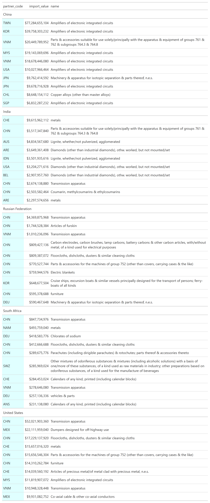

# Summarize Eonomic Strength measured in terms of Deficits and Currencies

**Introduction**
---------------
The purpose of this repository is to use available data to analyze the relative strength of countries. With the increasing geopolitical uncertainty notably the war in Ukraine and associated chatter about WW3, competition between powerful countries is heating up. According to Ray Dalio's book The Changing World Order, the five most important measures that determine a Nation's present and future changes in wealth and income are the following:

* Innovation
* The capital market cycle
* Internal order/disorder cycle
* External order-disorder cycle
* Acts of Nature

Attempting to measure innovation by country is too difficult a task to approach in this exercise. One interesting study on innovation which focuses mostly on US corporations is Kai Wu's paper on Investing in Innovation. Similarly, we won't attempt to explain the relative order/disorder between countries nor do we have the capability to predict Acts of Nature. Using macroeconomic literature and open source data, this repo attempts to rank countries by 1) the value of exported goods and services, 2) debt levels(both public and private), and 3) the strength of each country's currency.
**Data Source**

---------------
We use the Atlas of Economic Complexity from the Growth Lab at Harvard University because this data source is: 1) Detailed down to the product level that each country in the World trades from 1962 to 2020. 2) Standardized to simplify the process of building a time series to track changes over time. 3) Regularly used and highly cited source with over eighty thousand downloads. It is also publicly available and can be downloaded here.


**Exploratory Data Analysis**
--------------------------------

Below we plot trade relationships between the United States, China, and Russia. For this plot, we sum data for the latest available year, 2020. The trade balance is measured in Billions of US dollars.

In 2020, China had a surplus relative to the United States, Hong Kong, Great Britain, India, and the Netherlands. With the United States, China exported $200+ Billion dollars worth of products and services in excess of the value of products/services China imported from the United States. Interestingly, Russia and the US had negligible differences in terms of the monetary value of their bilateral imports/exports.

**Figure 1: 2020 Trade Balance**


Not all products are created equal. The plot above shows aggregated measures of exports but does not include details on what these traded products are. In the table below, we show the top exports for each of the countries from figure 1 classified by Maslow's hierarchy of needs. 

**Interactive Application**

https://www.loom.com/share/3a51af3bd7f64a10a6db2eee8c78a872


**How to run Interactive App on your local machine**
```{python}
git clone https://github.com/LNshuti/international-trade-ilustrated.git
cd international-trade-ilustrated
pip install -r requirements.txt

cd python/app
streamlit run trade-app.py
```
**United States Trade Balance: 2020**
```{python}
    2.13 T - 2.72 T = 0.59 T Trade Deficit
    
    0.59 T / 330 M = $1788 Deficit Per Person
```


**Figure 2: Top 20 Indebtness by Country**


**Figure 3 GDP per capita (current US$)**


**USA Imports**


**USA Exports**


**China Trade Balance:**
```{python}
2.01 T - 2.81 T = 0.8 T Trade Deficit
0.8 T /  1.41 B = $57 Deficit Per Person
```

**China Imports**


**China Exports**


**Mexico Imports**


**Mexico Exports**


**Mexico Opportunities**


### Global Market Share
-----------------------

**China**


**USA**


**Russian Federation**


**Mexico**


**Rising Asia**


**Declining Museum**


**South America**


**USA USA USA**


**SouthEastern Asia**


**North Europe**


**Figure 2: Top 10 Product Imports**



**Global Currencies and Reserves**


 
**Source:** https://data.imf.org/?sk=E6A5F467-C14B-4AA8-9F6D-5A09EC4E62A4


**Appendix:**
-------------

The charts below are taken from the Atlas for Economic Complexity website at Harvard University. For more details follow this [link](https://atlas.cid.harvard.edu/explore ).

**Canadian Exports**


**Canadian Imports**


**France Exports**


**France Imports**


**France Trade Partners**

**Exports**


**Imports**


**Russian Exports**


**Russian Imports**


**Russian Trade Partners Circa 2020. Imports by Russia**


**Russian Trade Partners Circa 2020. Exports by Russia**


**German Imports**


**German Exports**


### References 
1. The Growth Lab at Harvard University. International Trade Data (SITC, Rev. 2). 2019-05-31. 2019. V5. Harvard Dataverse. URL. https://doi.org/10.7910/DVN/H8SFD2. doi/10.7910/DVN/H8SFD2

2. Wu, Kai. September 2022. Liquid Venture Capital. Sparkline Capital. https://www.sparklinecapital.com/post/liquid-venture-capital

3. Replicate Canada Export Plot. https://atlas.cid.harvard.edu/explore 
